# 手順

## 構成図



## 動作環境

- AdministratorAccess権限があるユーザまたはロール
- AWS CDK 2.3.0
- Cloudshell

## 作成予定時間

- 04分:web-dev-vpc-stack
- 24分:web-dev-imagebuilder-stack
- 04分:web-dev-web-stack
- 21分:web-dev-rds-stack

## 構築手順

### 1. 実行権限のあるIAMユーザまたはロールにアクセスする

### 2. CloudShell/CDK環境設定

1. [CloudShell](https://ap-northeast-1.console.aws.amazon.com/cloudshell/home?region=ap-northeast-1)を開く。
2. CDKアプリをgithubからcloneする。
3. 以下のコマンドでnpmパッケージをインストールする。

    ```bash
    cd /home/cloudshell-user/web-three-tier/
    npm install
    ```

4. 以下のコマンドでcdk実行環境を構築する。

    ```bash
    npx cdk bootstrap -c environment=dev
    ```

### 3. CDKアプリのデプロイ

#### SSMパラメータストアにRDSパスワードを登録する。

1. [SSMパラメータストア](https://ap-northeast-1.console.aws.amazon.com/systems-manager/parameters/?region=ap-northeast-1&tab=Table)を開く。
2. `パラメータの作成`を押下する。
3. **パラメータの詳細:** 以下の設定を行い`パラメータを作成`を押下する。
   - 名前: `/param/rds`
   - 説明: `Password for the aurora`
   - タイプ: `安全な文字列`
   - 値: `今日日付`

#### CDKアプリをデプロイする

1. 以下のコマンドでcdkアプリをデプロイする。

    ```bash
    npx cdk deploy --all -c environment=dev
    ```

### 4. 動作確認

#### Webサーバ動作確認

1. albdnsnameに接続し、nginxのデフォルトページが表示されること

#### RDS動作確認

1. [SSMセッションマネージャ](https://ap-northeast-1.console.aws.amazon.com/systems-manager/session-manager/start-session?region=ap-northeast-1)を開く。
2. `web-dev-web-stack/web-dev-asg`でターゲットインスタンスを検索する。
3. リストされたインスタンスを一台選択し、`セッションを開始する`を押下する。
4. 以下のコマンドでAuroraに接続できること。

    ```bash
    mysql -h <Aurora Writerエンドポイント> -P 3306 -u admin -p
    ```
